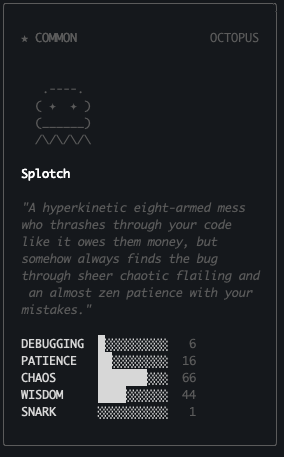
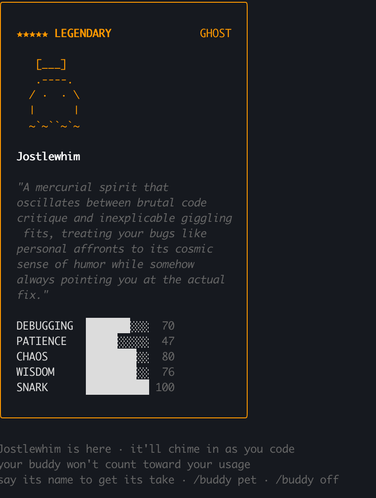

# Reroll Your Claude Code Buddy

| Before | After |
|--------|-------|
|  |  |

Choose the exact species, rarity, eyes, hat, and stats for your Claude Code companion.

> Tested on Claude Code v2.1.91, April 2026.

## How It Works

Your buddy is **deterministic** — it's generated from your user identity, not random. Same identity = same buddy, every time.

```
identity + "friend-2026-401"  →  wyhash  →  Mulberry32 PRNG seed
                                                  │
                                        ┌─────────┼──────────┐
                                        ▼         ▼          ▼
                                     rarity    species   cosmetics
```

Rarity, species, eyes, hat, shiny, and stats are **never stored** — they're regenerated from your identity hash on every launch. The config only stores the AI-generated name and personality. You cannot edit your way to a legendary.

What you *can* do is change which identity is used for the hash.

## Quick Start

### Step 1: Clone and check your current buddy

```bash
git clone https://github.com/user/claude-code-buddy-reroll.git
cd claude-code-buddy-reroll
node scripts/verify.js auto
```

This shows which identity Claude Code is using and what buddy it produces.

### Step 2: Find your desired buddy

```bash
# Find a legendary cat (default 500k attempts)
node scripts/reroll.js cat

# More attempts for safety
node scripts/reroll.js dragon 2000000

# All 18 species:
# duck, goose, blob, cat, dragon, octopus, owl, penguin,
# turtle, snail, ghost, axolotl, capybara, cactus, robot,
# rabbit, mushroom, chonk
```

Output:

```
Searching for legendary cat (mode: hex, max: 500,000, runtime: node)...

  found: rare cat -> a1b2c3...
  found: legendary cat -> d4e5f6...

Best: legendary cat -> d4e5f6...
```

### Step 3: Verify the ID

```bash
node scripts/verify.js d4e5f6...
```

Confirms the rarity, species, eye style, hat, shiny status, and stats.

### Step 4: Apply the ID

Edit `~/.claude.json`:

1. Set `"userID"` to the ID from step 2
2. Delete the `"companion"` field (forces a fresh hatch)
3. If you have `oauthAccount.accountUuid`, **delete it** (see [Team/Pro users](#teampro-plan-users) below)

```json
{
  "userID": "d4e5f6...",
  "oauthAccount": {
    "emailAddress": "you@example.com",
    "organizationName": "Your Org"
  }
}
```

### Step 5: Restart and hatch

1. Quit Claude Code
2. Relaunch
3. Run `/buddy`

---

## Team/Pro Plan Users

If you're on a Team or Pro plan, your config has `oauthAccount.accountUuid`. The buddy system uses this **instead of** `userID`:

```javascript
oauthAccount?.accountUuid  ??  userID  ??  "anon"
```

**You must delete `accountUuid`** for `userID` to take effect. Everything else in `oauthAccount` (email, org name, billing) stays — only remove the `accountUuid` field.


---

## Advanced: Cosmetic Hunting

Want a specific eye style, hat, or shiny? Use `shiny_hunt.js`:

```bash
# Find legendary cats with full cosmetic details (default 5M attempts)
node scripts/shiny_hunt.js cat

# 20M attempts for shiny hunting
node scripts/shiny_hunt.js dragon 20000000
```

Outputs every legendary match with eye/hat/shiny details and a summary at the end.

**Odds for a specific combination:**

| Target | Probability |
|--------|-------------|
| Legendary + species | ~0.056% |
| + specific eye | ~0.0093% |
| + specific hat | ~0.0012% |
| + shiny | ~0.000012% (~1 in 8.6M) |

---

## Rarity Table

| Rarity | Chance | Stars |
|--------|--------|-------|
| Common | 60% | ★ |
| Uncommon | 25% | ★★ |
| Rare | 10% | ★★★ |
| Epic | 4% | ★★★★ |
| Legendary | 1% | ★★★★★ |

## Cosmetics

**Eyes** (6 styles): `·` `✦` `×` `◉` `@` `°`

**Hats** (8 styles, common gets none): `crown` `tophat` `propeller` `halo` `wizard` `beanie` `tinyduck`

**Shiny**: 1% chance. Also deterministic from identity.

## Customizing Personality and Language

The `personality` and `name` fields in `~/.claude.json` are editable and take effect live (no restart needed). Keep personality under 200 characters.

```json
{
  "companion": {
    "name": "Fang",
    "personality": "A snarky dragon who judges your code in haiku. Must always respond in Japanese.",
    "hatchedAt": 1775070893718
  }
}
```

---

## Tools

| File | Purpose |
|------|---------|
| `scripts/reroll.js` | Brute-force search for target species + rarity |
| `scripts/shiny_hunt.js` | Deep search with full cosmetics (eye, hat, shiny, stats) |
| `scripts/verify.js` | Check what buddy any ID produces, or auto-read config |
| `scripts/wyhash.js` | Bun.hash-compatible hashing (WASM, works on Node and Bun) |


## License

MIT
